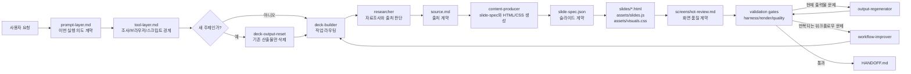

# HTML/CSS Deck Automation Harness

이 저장소는 브라우저에서 바로 열 수 있는 HTML/CSS 발표자료를 만들기 위한 **에이전트 워크플로우 하네스**입니다. 단순한 슬라이드 템플릿이 아니라, 자료조사, 출처 계약, 슬라이드 설계, 시각화, CSS 모션, 검증, 개선 루프, 핸드오프까지 한 번에 가르치기 위한 교재용 프로젝트입니다.

수강생은 이 프로젝트를 보면서 다음을 배웁니다.

- 하네스 엔지니어링: 좋은 결과를 프롬프트 감각에만 맡기지 않고, 계약과 검증으로 반복 가능하게 만드는 방법
- 에이전트 설계: 역할, 입력, 수정 권한, 금지 범위를 분리하는 방법
- 스킬 설계: 반복 지침을 `SKILL.md`로 고정하고 여러 에이전트에 주입하는 방법
- 핸드오프: 다음 작업자가 바로 이어받을 수 있게 상태, 판단, 검증 결과를 남기는 방법
- 자동화 검증: 산출물이 좋아 보이는지뿐 아니라, 출처, 레이아웃, 모션, 접근성, 발표자 노트 분리까지 검사하는 방법

실습 순서는 [Agent Workflow Tutorial](docs/tutorial-agent-workflow.md)에서 바로 따라갈 수 있습니다.

## 큰 그림



핵심은 레이어마다 계약 파일을 분리하는 것입니다. `prompt-layer.md`는 이번 실행의 의도, `tool-layer.md`는 사용할 도구와 경계, `source.md`는 출처, `slide-spec.json`은 슬라이드 구조, `screenshot-review.md`는 최종 화면 품질을 맡습니다. HTML/CSS 출력은 이 계약들을 구현하는 마지막 단계입니다.

## 빠른 시작

교육생에게 배포할 깨끗한 starter 복사본을 만들 때는 현재 작업 디렉터리를 직접 지우지 말고 별도 위치로 export합니다.

```sh
node lecture-deck/scripts/export-starter.js --out=/tmp/html-css-deck-starter
cd /tmp/html-css-deck-starter
node lecture-deck/scripts/run-hook.js harness-check
```

starter export는 에이전트, 스킬, 훅, 검증 스크립트, 디자인 규칙은 보존하고, 현재 주제 산출물, `.deck-quality`, 과거 실험 이미지, candidate/archive 디렉터리는 제외합니다. exported starter에는 현재 주제 문자열이 없는 중립 stub이 들어 있어 학생이 바로 하네스를 실행해볼 수 있습니다.

새 주제로 작업하기 전에 기존 발표자료 산출물을 지우고 싶다면 dry-run으로 삭제 대상을 먼저 확인합니다.

```sh
node .codex/skills/deck-output-reset/scripts/reset-deck-output.js --dry-run
node .codex/skills/deck-output-reset/scripts/reset-deck-output.js --apply
```

초기화는 주제별 산출물만 삭제합니다. 스킬, 에이전트, 훅, 검증 스크립트, 디자인 규칙은 남기고, `deck.html`과 `presenter-review.html`의 제목/cache query만 중립 상태로 되돌립니다. 그래서 이전 주제 제목이 다음 주제에 섞이지 않습니다.

그 다음 `deck-builder` 흐름으로 자료조사부터 생성합니다.

```text
research -> source.md -> slide-spec.json -> slides/assets -> validation -> HANDOFF.md
```

현재 상태를 확인하는 기본 명령은 아래 하나입니다.

```sh
node lecture-deck/scripts/run-hook.js deck-loop
```

외부 agent runner를 붙이는 구조를 실습하려면 bundled mock adapter를 사용할 수 있습니다. 이 예제는 실제 AI 호출 대신 phase contract를 읽고 handoff 형태를 반환합니다.

```sh
DECK_AGENT_COMMAND="node lecture-deck/examples/agent-adapter/mock-agent.js" \
  node lecture-deck/scripts/orchestrated-runner.js --validate
```

`deck-loop`는 현재 상태를 보고 다음 행동을 알려줍니다. 예를 들어 reset 직후에는 `source.md`와 `slide-spec.json`이 없으므로 최종 검증 실패가 아니라 `uninitialized` 상태로 판단합니다.

주의: reset 직후 `deck-loop`를 실행하면 상태 확인을 위해 `.deck-quality/workflow-trace.jsonl`이 다시 생길 수 있습니다. 완전히 깨끗한 산출물 디렉터리 상태로 남기려면 확인 후 reset apply를 한 번 더 실행합니다.

덱이 `handoff-ready` 상태가 되면 `deck-loop`는 일반 산출물 검증인 `pre-handoff`와 `stop-quality`까지만 실행합니다. 하네스 자체를 고도화하고 싶을 때만 `quality-loop`를 따로 실행합니다.

생성된 덱을 로컬에서 확인하려면 다음을 실행합니다.

```sh
cd lecture-deck
python3 -m http.server 58940 --bind 127.0.0.1
```

브라우저에서 `http://127.0.0.1:58940/deck.html`을 엽니다.

## 이 프로젝트가 다루는 문제

### 원인

LLM으로 발표자료를 만들면 결과가 매번 달라집니다. 어떤 때는 자료조사가 얕고, 어떤 때는 슬라이드 메시지와 시각화가 맞지 않으며, 어떤 때는 CSS 애니메이션이 장식처럼 붙거나 접근성을 망칩니다. 사람이 눈으로 고치는 방식만 쓰면 같은 실패가 다음 주제에서도 반복됩니다.

### 결과

출력물은 만들어지지만 수업 자료로 재사용하기 어렵습니다. 수강생 입장에서는 “왜 이 결과가 나왔는지”, “어디를 고쳐야 다음 생성이 좋아지는지”, “현재 산출물 수정과 워크플로우 개선을 어떻게 나누는지”를 배우기 어렵습니다.

### 권장 구조

이 저장소는 다음 구조를 권장합니다.

- 산출물은 지울 수 있어야 합니다.
- 스킬, 에이전트, 훅, 검증 스크립트는 남아야 합니다.
- 프롬프트 의도, 도구 선택, 자료조사, 슬라이드 설계, 스크린샷 품질은 파일 계약으로 남겨야 합니다.
- 현재 덱만 고치는 작업과 다음 생성 품질을 올리는 작업은 다른 에이전트가 맡아야 합니다.
- 검증은 “잘 렌더링됨”에서 끝나지 않고, 출처, 레이아웃 중요도, 모션 목적, reduced motion까지 봐야 합니다.

## 핵심 개념

### Harness

하네스는 LLM이 자유롭게 산출물을 만들더라도 일정한 품질 기준 안에서 움직이게 하는 작업 환경입니다. 이 프로젝트의 하네스는 `.codex/skills`, `lecture-deck/agents`, `lecture-deck/hooks`, `lecture-deck/scripts`, `lecture-deck/design.md`, `lecture-deck/motion.md`로 구성됩니다.

### Agent

에이전트는 역할 단위 작업자입니다. 예를 들어 `researcher`는 조사만 하고 파일을 쓰지 않으며, `content-producer`는 실제 출력물을 만들 수 있습니다. 역할을 나누면 실패 원인이 명확해지고, 잘못된 수정 권한을 줄일 수 있습니다.

### Skill

스킬은 반복 지침입니다. 예를 들어 CSS 모션은 매번 “적절하게 움직여줘”라고 말하는 대신 `deck-css-motion-generation` 스킬에 `motionPlan`, 금지 규칙, reduced-motion 처리까지 고정합니다.

### Contract

계약은 다음 단계가 믿고 사용할 수 있는 구조화된 파일입니다. 이 프로젝트에서는 `prompt-layer.md`, `tool-layer.md`, `source.md`, `slide-spec.json`, `screenshot-review.md`가 주요 계약입니다.

### Gate

게이트는 통과해야 다음 단계로 갈 수 있는 자동 검사입니다. 예를 들어 `harness-check`는 레이어 계약 파일과 스펙 형태를 보고, `render-check`는 브라우저 렌더링 문제를 보고, `stop-quality`는 스크린샷 품질 문제를 봅니다.

### Handoff

핸드오프는 다음 작업자가 바로 이어받을 수 있도록 상태와 판단을 남기는 문서입니다. 최종 산출물에는 `lecture-deck/HANDOFF.md`가 포함됩니다.

## 디렉터리 구조

```text
.
├── README.md
├── .codex/
│   ├── agents/                 # Codex에서 실행 가능한 에이전트 등록 파일
│   ├── hooks.json              # 프로젝트 훅 연결
│   └── skills/                 # 재사용 가능한 작업 스킬
└── lecture-deck/
    ├── agents/                 # 에이전트 역할 설명 문서
    ├── hooks/                  # 검증 훅 정의
    ├── scripts/                # 검증, 상태 판단, 개선 루프 스크립트
    ├── assets/
    │   ├── style.css           # 공통 덱 스타일과 모션 토큰
    │   ├── deck.js             # 덱 런타임
    │   ├── presenter-review.js # 발표자 리뷰 런타임
    │   └── illustrations/      # 로컬 이미지 애셋
    ├── slides/                 # 생성된 슬라이드 HTML
    ├── deck.html               # 발표자료 셸
    ├── presenter-review.html   # 발표자 리뷰 셸
    ├── design.md               # 시각 디자인 규칙
    ├── design-quality.md       # 시각 품질 기준
    ├── motion.md               # CSS 모션 레퍼런스
    ├── prompt-layer.md         # 이번 실행 의도와 승격 규칙
    ├── current-run.json        # 현재 실행 주제, 범위, 검증 모드
    ├── tool-layer.md           # 조사, 브라우저, 스크립트, MCP/agent 도구 경계
    ├── tool-policy.json        # 에이전트별 도구/파일/증거 정책
    ├── agent-handoff.schema.json # 에이전트 handoff 산출물 스키마
    ├── screenshot-review.md    # 스크린샷 기반 화면 품질 계약
    ├── few-shots.md            # 좋은/나쁜 생성 예시
    └── evaluation-template.md  # 평가 템플릿
```

## 보존 파일과 삭제 가능한 산출물

새 주제로 다시 만들 때는 모든 것을 지우면 안 됩니다. 하네스는 교재의 핵심이고, 주제별 산출물만 초기화해야 합니다.

보존해야 하는 파일:

- `.codex/skills/**`
- `.codex/agents/**`
- `.codex/hooks.json`
- `lecture-deck/agents/**`
- `lecture-deck/hooks/**`
- `lecture-deck/scripts/**`
- `lecture-deck/design.md`
- `lecture-deck/design-quality.md`
- `lecture-deck/motion.md`
- `lecture-deck/prompt-layer.md`
- `lecture-deck/current-run.json`
- `lecture-deck/tool-layer.md`
- `lecture-deck/tool-policy.json`
- `lecture-deck/agent-handoff.schema.json`
- `lecture-deck/screenshot-review.md`
- `lecture-deck/few-shots.md`
- `lecture-deck/evaluation-template.md`
- `lecture-deck/deck.html`
- `lecture-deck/presenter-review.html`
- `lecture-deck/assets/style.css`
- `lecture-deck/assets/deck.js`
- `lecture-deck/assets/presenter-review.js`

삭제 가능한 주제별 산출물:

- `lecture-deck/source.md`
- `lecture-deck/slide-spec.json`
- `lecture-deck/HANDOFF.md`
- `lecture-deck/slides/*.html`
- `lecture-deck/assets/slides.js`
- `lecture-deck/assets/visuals.css`
- `lecture-deck/.deck-quality/**`
- `lecture-deck/assets/illustrations/*` 중 `README.md`를 제외한 주제별 이미지

초기화 스크립트는 보존 파일인 `deck.html`과 `presenter-review.html`을 삭제하지 않지만, 내부 제목과 cache query는 중립값으로 되돌립니다. 이는 셸 파일 자체는 하네스 자산이고, 그 안의 주제 문자열은 산출물 누수이기 때문입니다.

## 상태 모델

`lecture-deck/scripts/deck-loop-state.js`는 현재 덱 상태를 다음처럼 판단합니다.

| 상태 | 의미 | 다음 행동 |
| --- | --- | --- |
| `uninitialized` | `source.md` 또는 `slide-spec.json`이 없음 | 자료조사와 스펙 생성 |
| `spec-invalid` | `slide-spec.json` 파싱 실패 또는 slides 배열 없음 | 스펙 수정 |
| `spec-ready` | 스펙은 있지만 슬라이드 HTML이 없음 | 슬라이드와 assets 생성 |
| `output-ready` | 슬라이드는 있지만 `HANDOFF.md`가 없음 | 핸드오프 작성 |
| `handoff-ready` | 최종 검증 가능 | 전체 게이트 실행 |

이 모델 덕분에 reset 직후 상태를 실패로 오해하지 않고, 생성 파이프라인의 어디까지 왔는지 설명할 수 있습니다.

## 에이전트 구조

| 에이전트 | 역할 | 주요 입력 | 수정 권한 | 금지 사항 |
| --- | --- | --- | --- | --- |
| `researcher` | 공식 문서, 신뢰 출처, 이미지 후보 조사 | 사용자 요청, 기존 `source.md`, 웹 자료 | 기본 없음 | 슬라이드 생성, 파일 수정 |
| `content-producer` | 조사 내용을 실제 덱 초안으로 변환 | 연구 보고, `design.md`, `motion.md`, `few-shots.md` | `source.md`, `slide-spec.json`, `slides/*.html`, `assets/slides.js`, `assets/visuals.css`, `HANDOFF.md` | 검증 스크립트나 스킬 약화 |
| `slide-reviewer` | 흐름, 근거, 발표자 노트 분리, 스펙 누락 검토 | `slide-spec.json`, 슬라이드 HTML, presenter review | 기본 없음 | 출력물 직접 수정 |
| `visual-reviewer` | 레이아웃, 중요도, 시각 형식, CSS 모션 검토 | `design.md`, `motion.md`, 렌더링 증거 | 기본 없음 | 장식성 모션 승인 |
| `screenshot-quality-reviewer` | 스크린샷 기준으로 발표 가능 품질 판단 | `.deck-quality` 보고서와 스크린샷 | 기본 없음 | 단순 취향 피드백 |
| `output-regenerator` | 현재 덱 산출물만 고침 | 품질 보고서, 스펙, CSS | `slides/*.html`, `assets/visuals.css`, 필요한 경우 `HANDOFF.md` | 스킬, 훅, 검증 스크립트 수정 |
| `workflow-improver` | 다음 생성 품질을 높이도록 하네스 개선 | 실패 사례, 스킬, 디자인 문서, 검증 스크립트 | 스킬, 에이전트 문서, 디자인 문서, 검증 스크립트 | 현재 슬라이드 HTML 직접 수정 |
| `validation-runner` | 검증 명령 실행과 실패 요약 | 할당된 명령, 검증 결과 | 기본 없음 | 로그 전체 덤프, 임의 수정 |

수업에서 중요한 포인트는 `output-regenerator`와 `workflow-improver`의 차이입니다. 전자는 이번 결과물을 고치고, 후자는 다음 결과가 같은 방식으로 실패하지 않게 규칙과 게이트를 강화합니다.

## 스킬 카탈로그

| 스킬 | 목적 | 핵심 산출 또는 강제 규칙 |
| --- | --- | --- |
| `deck-builder` | 전체 덱 생성 흐름을 조율 | reset, research, spec, visual, validation, handoff 라우팅 |
| `deck-output-reset` | 새 주제를 위해 기존 산출물만 삭제 | dry-run 후 apply, 하네스 보존 |
| `deck-research-brief` | 자료조사 방향 설정 | 신뢰 출처, 공식 문서, 이미지 후보 |
| `deck-source-evidence-contract` | `source.md`의 필수 출처 계약 | evidence list, selection notes, asset decisions, slide-visible claims |
| `deck-asset-selection` | 이미지, CSS, Lucide, raster, none 선택 | `assetDecision` 스키마 |
| `deck-visual-hierarchy-layout` | 중요도 기반 레이아웃 배분 | `importanceMap`, 한글 가독성, 주요 증거 크기 |
| `deck-css-motion-generation` | 목적 있는 CSS 모션 생성 | `motionPlan`, transform/opacity 제한, reduced-motion |
| `deck-content-production` | 실제 덱 산출물 생성 | `source.md`, `slide-spec.json`, slides, assets, `HANDOFF.md` |
| `deck-spec-review` | 생성 전 스펙 품질 검토 | 누락된 근거, 과밀, 반복 구조 차단 |
| `deck-visual-motion` | 시각 구조와 모션 실행 검토 | visualForm과 실제 DOM/CSS 일치 |
| `deck-screenshot-quality` | 렌더링된 화면 품질 판단 | `.deck-quality` 보고서와 개선 경로 |
| `deck-validation-gate` | 검증 명령 실행과 해석 | hook 명령, mutation loop, improvement loop |

스킬은 한 에이전트 전용이 아닙니다. 예를 들어 `deck-css-motion-generation`은 `content-producer`, `visual-reviewer`, `output-regenerator`, `workflow-improver`에 모두 주입됩니다. 이렇게 하면 생성, 검토, 수정, 워크플로우 개선이 같은 기준을 공유합니다.

## 핵심 계약 파일

### `prompt-layer.md` / `current-run.json`

`prompt-layer.md`는 한 번만 쓰는 요청과 반복 규칙을 어디로 승격할지 설명하는 durable rule입니다. 실제 현재 실행의 주제, 대상, 기대 결과, 범위, 자료조사 필요 여부, reset 여부, 시각 우선순위, 모션 우선순위, 검증 기준은 `current-run.json`에 기록합니다.

중요한 점은 프롬프트에 반복 규칙을 계속 쌓지 않는 것입니다. 한 번만 쓰는 말은 prompt layer에 남기고, 반복되는 규칙은 `CLAUDE.md`, `AGENTS.md`, 스킬, 에이전트, 훅, 평가 케이스로 승격합니다.

### `tool-layer.md` / `tool-policy.json`

`tool-layer.md`는 어떤 도구를 언제 쓰는지 설명하는 사람용 계약입니다. `tool-policy.json`은 같은 내용을 에이전트별 `sandboxMode`, `allowedActions`, `allowedPaths`, `requiredSkills`, `requiredEvidence`, `prohibitedActions`로 바꾼 기계 검증 계약입니다.

이 계약이 없으면 에이전트가 쓸데없는 자료를 가져오거나, 이미지가 필요한 곳에 약한 CSS 그림을 만들거나, 검증 실패를 단순 출력물 문제로만 처리하기 쉽습니다.

### `agent-handoff.schema.json`

`agent-handoff.schema.json`은 에이전트가 다음 단계로 넘길 최소 산출물 형식을 고정합니다. 모든 전문 에이전트는 발견, 수행, 판단, 미해결뿐 아니라 `evidence`, `filesTouched`, `nextGate`를 남겨야 합니다. 이 스키마가 있어야 오케스트레이터가 “좋아 보이는 보고”가 아니라 다음 게이트가 소비할 수 있는 handoff를 받을 수 있습니다.

### `source.md`

`source.md`는 자료조사 결과를 단순히 모아둔 문서가 아니라, 슬라이드에 쓸 수 있는 사실과 발표자 노트에만 둘 맥락을 구분하는 출처 계약입니다.

필수 섹션:

- `## Evidence list`
- `## Research selection notes`
- `## Image and asset decisions`
- `## Slide-visible claims`
- `## Speaker-note context`
- `## Unresolved risks`

현재성이 있거나 출처 민감도가 높은 주제는 신뢰 가능한 URL 8개 이상을 요구합니다. 공식 문서가 존재하는 제품이나 도구 주제라면 공식 문서 URL 5개 이상을 기본 기준으로 둡니다. 불가능한 경우에는 `Unresolved risks`에 이유를 남겨야 합니다.

### `slide-spec.json`

`slide-spec.json`은 슬라이드 생성을 위한 중심 계약입니다. 모든 슬라이드는 최소한 다음 성격의 정보를 가져야 합니다.

```json
{
  "id": "slide-01",
  "file": "slides/01-intro.html",
  "title": "슬라이드 제목",
  "message": "청중이 기억해야 하는 한 문장",
  "visual": "무엇을 보여줄지",
  "speakerNote": "발표자 전용 설명",
  "evidence": ["https://example.com/source"],
  "importanceMap": {
    "primaryMessage": "가장 중요한 문장",
    "primaryEvidenceOrAction": "가장 크게 보여줄 증거 또는 행동",
    "secondaryConstraints": ["보조 포인트"],
    "metadata": ["출처 라벨"]
  },
  "assetDecision": {
    "mode": "official-image",
    "reason": "실제 화면이 설명 대상이기 때문",
    "source": "https://example.com/image",
    "fallback": "HTML/CSS annotated module"
  },
  "visualForm": "annotated-screenshot",
  "motionDecision": {
    "mode": "static",
    "reason": "참조 화면이므로 움직임보다 판독성이 중요함"
  }
}
```

### `screenshot-review.md`

`screenshot-review.md`는 DOM이나 JSON이 아니라 실제 화면을 기준으로 통과 여부를 판단하는 계약입니다. `stop-quality`는 이 계약에 따라 데스크톱 초기 상태, 데스크톱 모션 settled 상태, 모바일 상태, presenter-review 화면을 캡처합니다.

`stop-quality`가 실행되면 `.deck-quality/screenshot-review.json`도 같이 생성됩니다. `visual-quality-report.md`가 있는데 이 파일이 없으면 최종 handoff는 실패해야 합니다.

중요한 규칙은 하나입니다. 훅이 통과했는데 사람이 본 스크린샷이 깨져 있으면, 그건 산출물만의 문제가 아니라 하네스 결함입니다. 이 경우 `visual-quality-gate.js`, `design.md`, `few-shots.md`, 관련 스킬이나 평가 케이스를 먼저 강화한 뒤 현재 출력물을 고칩니다.

`importanceMap`, `assetDecision`, `visualForm`, `motionDecision`은 반복 품질 문제를 줄이기 위해 추가된 필수 계약입니다. 이 필드들이 없으면 “중요한 내용과 부가 내용이 같은 크기로 보이는 문제”, “CSS로 그리면 안 되는 대상을 억지로 그리는 문제”, “모션이 장식처럼 붙는 문제”가 반복됩니다.

### 디자인 톤 게이트

`design.md`는 따뜻한 종이, 크림 카드, 짙은 잉크 라인을 기본 톤으로 둡니다. 검정은 텍스트, 선, 작은 라벨, 작은 상태 배지에는 쓸 수 있지만, 큰 면을 채우는 기본 색이 아닙니다.

그래서 현재 워크플로우는 다음을 실패로 봅니다.

- 큰 터미널 패널, 허브, 프리뷰 카드, 안내 블록을 순검정 또는 near-black으로 채움
- 대비는 충분하지만 전체 덱의 종이/크림 톤과 맞지 않는 어두운 덩어리
- 모든 섹션 라벨을 검은 pill로 만들어 메타데이터가 과하게 튀는 화면

이 실패는 단순 취향 문제가 아니라 `deck-screenshot-quality`, `deck-visual-motion`, `visual-quality-gate.js`가 함께 다루는 워크플로우 품질 문제입니다. 현재 산출물만 고칠 때는 `output-regenerator`, 다음 생성에서 반복되지 않게 할 때는 `workflow-improver`로 라우팅합니다.

### `importanceMap`

`importanceMap`은 레이아웃의 우선순위를 정합니다.

- `primaryMessage`: 청중이 반드시 기억해야 하는 문장
- `primaryEvidenceOrAction`: 메시지를 가르치는 실제 화면, 이미지, 예시, 프로세스
- `secondaryConstraints`: 보조 설명
- `metadata`: 출처, 작은 라벨, 부가 정보

규칙은 단순합니다. 주요 메시지가 커야 하지만, 주요 증거를 밀어내면 안 됩니다. 공식 이미지나 실제 인터페이스가 가르치는 대상이면 썸네일이 아니라 교육용 크기로 배치해야 합니다.

### `assetDecision`

`assetDecision.mode`는 다음 중 하나입니다.

| mode | 사용 시점 |
| --- | --- |
| `official-image` | 공식 제품 화면, 정부 안내 이미지, 공식 다이어그램이 핵심 증거일 때 |
| `local-raster` | HTML/CSS로 만들면 조잡해지는 개념 장면이 필요할 때 |
| `lucide-html-css` | 업로드, 파일, 링크, 경고, 체크 같은 보편적 행동과 상태 |
| `css-module` | 추상 구조, 표, 레일, 퍼널, 매트릭스, 타임라인 |
| `none` | 시각 자료가 오히려 방해되는 짧은 참조나 경고 |

복잡한 물체, 사람, 기기, 깃발 같은 인식 가능한 대상을 CSS pseudo-element로 그리는 것은 피합니다. 실제 자료가 있으면 이미지로 쓰고, 없으면 추상화하거나 생략합니다.

### `motionPlan`

움직이는 슬라이드는 `motionDecision.mode: "animated"`와 함께 `motionPlan`을 가져야 합니다.

```json
{
  "purpose": "모션이 설명하는 의미",
  "recipe": "process-rail",
  "targets": [
    {
      "selector": ".step-1",
      "effect": "enter",
      "delayStep": 0
    }
  ],
  "mustNotAnimate": ["h1", ".copy"],
  "reducedMotion": "show final state"
}
```

CSS 모션은 JavaScript 애니메이션 라이브러리 없이 순수 CSS로 구현합니다. 움직일 수 있는 속성은 기본적으로 `transform`과 `opacity`입니다. 텍스트를 깜빡이게 하거나, 레이아웃 크기를 흔들거나, 모든 카드에 같은 fade를 붙이는 방식은 거부합니다.

## 검증 훅

기본 검증은 `run-hook.js`로 실행합니다.

```sh
node lecture-deck/scripts/run-hook.js deck-loop
```

집중 검증이 필요하면 다음을 실행합니다.

```sh
node lecture-deck/scripts/run-hook.js harness-check
node lecture-deck/scripts/run-hook.js render-check
node lecture-deck/scripts/run-hook.js stop-quality
node lecture-deck/scripts/run-hook.js pre-handoff
```

각 훅의 의미는 다음과 같습니다.

| 훅 | 확인하는 것 |
| --- | --- |
| `harness-check` | 필수 파일, 스펙 형태, 출처 계약, 로컬 링크, 안전하지 않은 CSS |
| `render-check` | 브라우저 렌더링, 오버플로우, 발표자 노트 노출, reduced-motion 동작 |
| `stop-quality` | 스크린샷 기준 시각 품질, 가독성, 레이아웃, 모션 품질 |
| `pre-handoff` | 최종 전달 전 전체 준비 상태 |
| `deck-loop` | 일반 생성/검증 루프. 상태에 맞는 검증 경로를 선택하고 handoff-ready에서는 `pre-handoff`, `stop-quality` 실행 |
| `quality-loop` | 하네스 개선 루프. 통제된 시각/모션 결함과 mutation 결함을 게이트가 실제로 잡는지 확인 |

`stop-quality`가 실패하면 `.deck-quality/visual-quality-report.md`와 `.deck-quality/quality-remediation-plan.json`을 확인합니다. 현재 출력물만 고칠 문제면 `output-regenerator`, 생성 규칙 자체가 약한 문제면 `workflow-improver`로 보냅니다.

## 개선 루프

이 프로젝트에는 단발성 검증 외에 개선 루프도 있습니다.

```sh
cd lecture-deck
node scripts/run-hook.js quality-loop
node scripts/improvement-loop.js --max-iterations=8 --threshold-percent=10
node scripts/improvement-loop.js --focus=motion --max-iterations=4 --threshold-percent=10
node scripts/motion-mutation-loop.js --max-mutants=7
```

`improvement-loop`는 통제된 실패를 주입한 뒤 게이트가 결함을 감지하고, 수리 단계가 실제 점수를 개선하며, no-op 단계가 가짜 개선으로 보이지 않는지 확인합니다. `gateHealth: failed`가 나오면 현재 슬라이드 문제가 아니라 하네스 게이트 결함으로 보고 `workflow-improver`로 보냅니다.

`improvement-loop --focus=motion`은 CSS 모션 결함 감지와 복구의 gate-health check입니다. `motion-mutation-loop`는 더 엄격한 mutation-score gate입니다. 실제로 일어날 법한 CSS 모션 결함을 임시 덱에 주입하고, 살아남은 mutant가 있으면 “현재 덱이 괜찮다”가 아니라 “게이트가 약하다”로 판단합니다.

일반 덱 생성 작업에서는 `deck-loop`만 사용합니다. `quality-loop`는 결과물을 다시 만드는 루프가 아니라, 하네스 엔지니어링 스킬, 검증 게이트, 모션 규칙, few-shot, 에이전트 라우팅을 고도화하기 위한 별도 루프입니다.

## 실패 라우팅

| 실패 유형 | 보내야 할 곳 | 이유 |
| --- | --- | --- |
| 출처가 얕거나 공식 문서가 부족함 | `researcher`, `deck-source-evidence-contract` | 슬라이드 생성 전에 근거 계약을 강화해야 함 |
| `slide-spec.json` 필드 누락 | `slide-reviewer`, `content-producer` | HTML/CSS 생성 전에 계약을 고쳐야 함 |
| 주요 이미지가 너무 작거나 제목이 과도하게 큼 | `visual-reviewer`, `output-regenerator` | 현재 출력물의 레이아웃 수정 |
| CSS로 조잡한 그림을 그림 | `deck-asset-selection`, `workflow-improver` | 다음 생성에서도 반복되지 않게 asset 규칙 강화 |
| 모든 슬라이드가 카드 그리드처럼 보임 | `deck-visual-hierarchy-layout`, `deck-visual-motion`, `workflow-improver` | visualForm 다양성과 검증 강화 |
| 모션이 거의 없거나 장식적 fade만 있음 | `deck-css-motion-generation`, `workflow-improver` | motionPlan 기반 생성 규칙 강화 |
| 큰 검정 면이 디자인 톤을 깨뜨림 | `deck-visual-motion`, `deck-screenshot-quality`, `workflow-improver` | 대비 통과와 별개로 warm paper 디자인 톤을 지켜야 함 |
| `improvement-loop`의 `gateHealth` 실패 | `workflow-improver`, `deck-validation-gate` | 통제 결함을 못 잡거나 no-op이 개선처럼 보이는 게이트 결함 |
| 살아남은 motion mutant | `workflow-improver`, `deck-css-motion-generation` | 모션 결함을 잡는 검증 규칙 또는 mutation 정의 보강 |
| validation 로그가 너무 김 | `validation-runner` | 긴 로그를 실패 근거 중심으로 요약 |

## 수업용 실습

### 실습 1: 산출물 초기화

1. dry-run을 실행합니다.
2. 어떤 파일이 삭제 대상인지 설명합니다.
3. `deck.html`과 `presenter-review.html`은 삭제되지 않고 제목/cache query만 중립화된다는 점을 확인합니다.
4. apply를 실행합니다.
5. `deck-loop`가 `uninitialized`를 보고하는지 확인합니다.

```sh
node .codex/skills/deck-output-reset/scripts/reset-deck-output.js --dry-run
node .codex/skills/deck-output-reset/scripts/reset-deck-output.js --apply
node lecture-deck/scripts/run-hook.js deck-loop
```

학습 포인트: 하네스와 산출물을 분리해야 새 주제를 안전하게 시작할 수 있습니다.

### 실습 2: 새 주제 source/spec 만들기

1. `researcher` 역할로 공식 출처를 모읍니다.
2. `source.md`의 필수 섹션을 채웁니다.
3. `slide-spec.json`에 `importanceMap`, `assetDecision`, `visualForm`, `motionDecision`을 넣습니다.
4. `harness-check`로 계약 누락을 확인합니다.

학습 포인트: 좋은 슬라이드는 HTML을 쓰기 전에 출처와 설계 계약에서 시작됩니다.

### 실습 3: 레이아웃 실패 고치기

일부러 큰 제목과 작은 핵심 이미지가 있는 슬라이드를 만든 뒤 `stop-quality`를 실행합니다. 실패 보고서가 `primaryEvidenceOrAction`을 어떻게 판단하는지 봅니다.

학습 포인트: 예쁜 화면보다 중요한 것은 메시지와 증거의 시각적 우선순위입니다.

### 실습 4: CSS 모션 검증하기

`motionPlan`이 있는 슬라이드에서 target selector를 틀리게 만들고 `motion-mutation-loop`를 실행합니다.

학습 포인트: 모션은 “있다/없다”가 아니라 목적, 대상, 순서, reduced-motion까지 검증해야 합니다.

### 실습 5: 현재 출력물 수정과 워크플로우 개선 분리하기

같은 실패를 두 번 만든 뒤 한 번은 `output-regenerator` 관점으로, 한 번은 `workflow-improver` 관점으로 해결책을 씁니다.

학습 포인트: 지금 덱만 고치는 일과 다음 생성 품질을 높이는 일은 다릅니다.

### 실습 6: 검정 면 실패를 워크플로우로 승격하기

터미널 패널이나 허브맵을 일부러 거의 검정색 큰 면으로 만든 뒤 `stop-quality`를 실행합니다. 대비가 좋아도 덱 톤과 맞지 않으면 실패로 분류되어야 합니다.

학습 포인트: “읽힌다”와 “디자인 시스템에 맞는다”는 다른 기준입니다. 반복되는 미감 실패는 개인 취향으로 끝내지 말고 디자인 규칙, 스킬, 스크린샷 게이트로 승격합니다.

## 자주 발생하는 실수

- 기존 산출물을 지우지 않고 새 주제를 생성해서 이전 내용이 섞임
- `source.md` 없이 슬라이드부터 생성함
- 공식 이미지가 핵심 증거인데 작은 썸네일로 배치함
- 모든 슬라이드를 같은 카드 그리드로 만듦
- 큰 검정색 면을 터미널, 허브, 프리뷰 카드의 기본 배경처럼 사용함
- CSS로 복잡한 사물이나 장면을 직접 그려 품질이 떨어짐
- `motionDecision`은 있는데 실제 CSS 애니메이션이 없음
- animated slide에 `motionPlan`이 없음
- reduced-motion 처리를 누락함
- 검증을 통과시키려고 훅이나 스크립트를 약화함
- 현재 출력물 문제를 고치면서 스킬과 검증 규칙까지 임의로 바꿈

## 레퍼런스 명령 모음

```sh
# 현재 덱 상태 판단
node lecture-deck/scripts/run-hook.js deck-loop

# 산출물 초기화
node .codex/skills/deck-output-reset/scripts/reset-deck-output.js --dry-run
node .codex/skills/deck-output-reset/scripts/reset-deck-output.js --apply

# 집중 검증
node lecture-deck/scripts/run-hook.js harness-check
node lecture-deck/scripts/run-hook.js render-check
node lecture-deck/scripts/run-hook.js stop-quality
node lecture-deck/scripts/run-hook.js pre-handoff

# 개선 루프
cd lecture-deck
node scripts/run-hook.js quality-loop
node scripts/improvement-loop.js --max-iterations=8 --threshold-percent=10
node scripts/improvement-loop.js --focus=motion --max-iterations=4 --threshold-percent=10
node scripts/motion-mutation-loop.js --max-mutants=7

# 로컬 미리보기
cd lecture-deck
python3 -m http.server 58940 --bind 127.0.0.1
```

## 읽는 순서

처음 보는 수강생에게는 다음 순서를 권장합니다.

1. 이 `README.md`
2. `.codex/skills/deck-builder/SKILL.md`
3. `.codex/skills/deck-output-reset/SKILL.md`
4. `.codex/skills/deck-source-evidence-contract/SKILL.md`
5. `.codex/skills/deck-visual-hierarchy-layout/SKILL.md`
6. `.codex/skills/deck-css-motion-generation/SKILL.md`
7. `lecture-deck/agents/content-producer.md`
8. `lecture-deck/agents/workflow-improver.md`
9. `lecture-deck/scripts/deck-loop-state.js`
10. `lecture-deck/scripts/visual-quality-gate.js`

이 순서로 보면 “왜 스킬을 만들었는지”, “어떤 에이전트에 주입되는지”, “검증이 어디서 실패를 잡는지”, “다음 생성 품질을 어떻게 개선하는지”를 한 흐름으로 이해할 수 있습니다.
